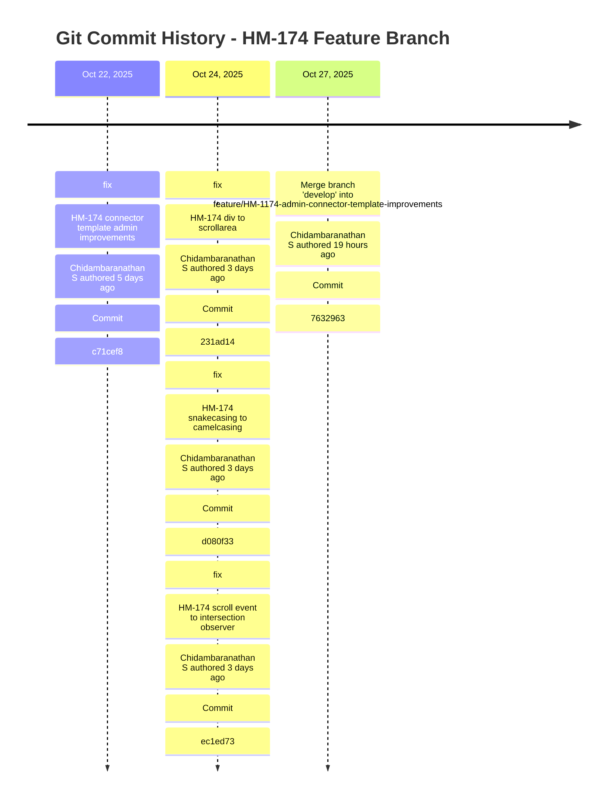
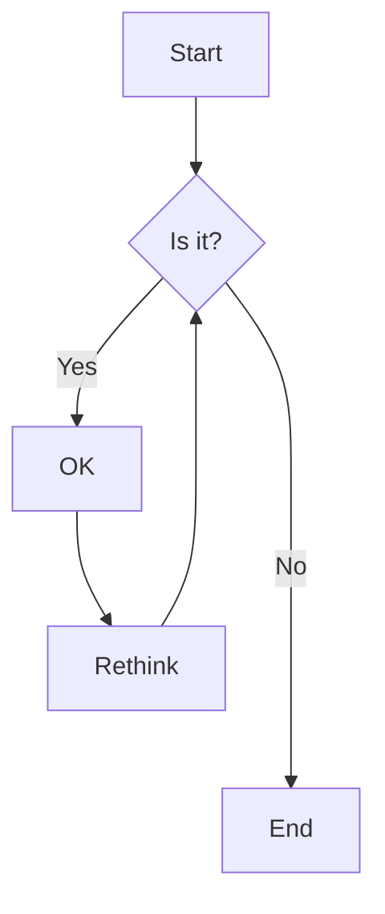
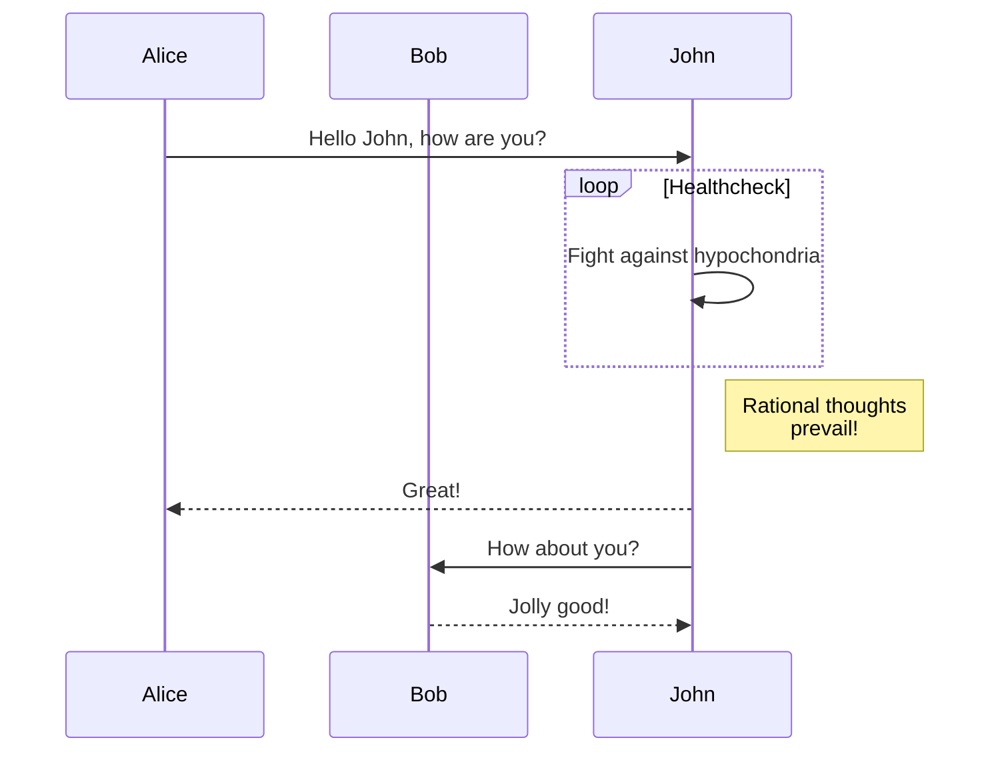
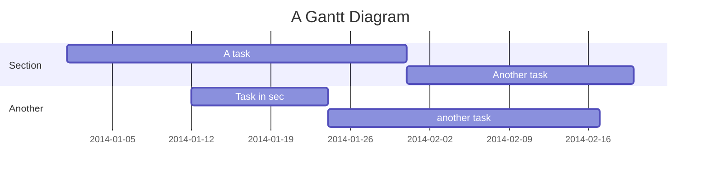
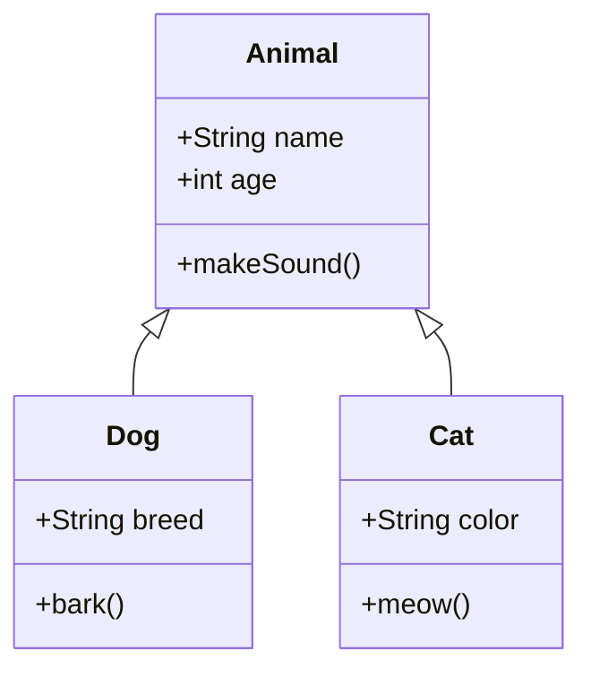
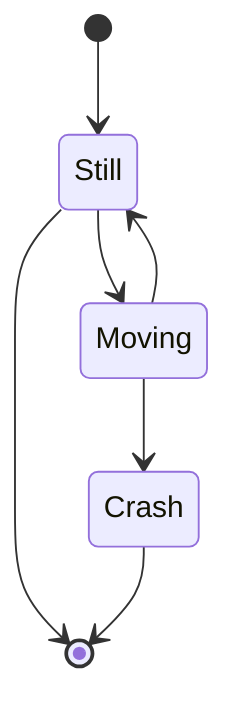

# Mermaid Diagram Examples

This file contains various Mermaid diagram examples for documentation and visualization purposes.

## Git Commit Timeline

```mermaid
gitgraph
    commit id: "c71cef8: fix: HM-174 connector template admin improvements"
    commit id: "231ad14: fix: HM-174 div to scrollarea"
    commit id: "d080f33: fix: HM-174 snakecasing to camelcasing"
    commit id: "ec1ed73: fix: HM-174 scroll event to intersection observer"
    commit id: "7632963: Merge branch 'develop' into feature/HM-1174-admin-connector-template-improvements"
```

## Alternative Git Timeline (Timeline View)



## Flowchart Example



## Sequence Diagram Example



## Gantt Chart Example



## Class Diagram Example



## State Diagram Example

