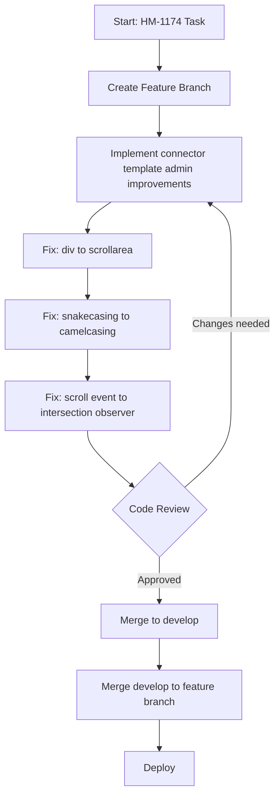
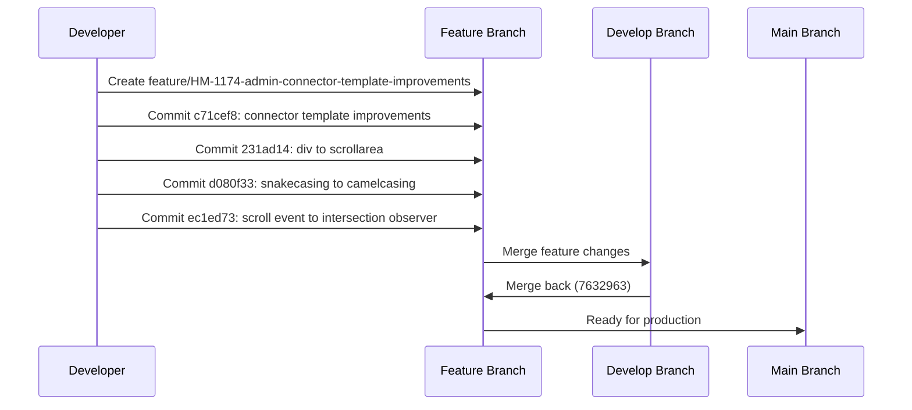

# Mermaid Diagram Examples - HM-1174 Project

This document contains Mermaid diagrams documenting the HM-1174 project timeline and structure.

## Git Graph Example - HM-1174 Project Timeline

```mermaid
gitgraph
    commit id: "Initial commit"
    commit id: "Base setup"
    branch feature/HM-1174-admin-connector-template-improvements
    checkout feature/HM-1174-admin-connector-template-improvements
    commit id: "c71cef8: connector template admin improvements"
    commit id: "231ad14: div to scrollarea"
    commit id: "d080f33: snakecasing to camelcasing"
    commit id: "ec1ed73: scroll event to intersection observer"
    checkout main
    merge feature/HM-1174-admin-connector-template-improvements
    commit id: "7632963: Merge develop branch"
```

## Project Timeline

- **Oct 27, 2025**: Merge branch 'develop' into feature/HM-1174-admin-connector-template-improvements
  - Author: Chidambaranathan S
  - Time: 19 hours ago
  - Commit: `7632963`

- **Oct 24, 2025**: Multiple fixes implemented
  - fix: HM-1174 scroll event to intersection observer (3 days ago) - `ec1ed73`
  - fix: HM-1174 snakecasing to camelcasing (3 days ago) - `d080f33`
  - fix: HM-1174 div to scrollarea (3 days ago) - `231ad14`

- **Oct 22, 2025**: Initial feature implementation
  - fix: HM-1174 connector template admin improvements (5 days ago) - `c71cef8`

## Flowchart - Feature Development Process



## Sequence Diagram - Development Workflow

